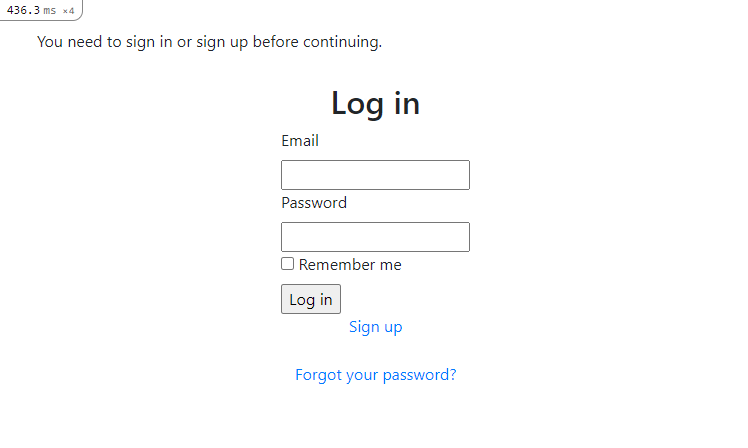
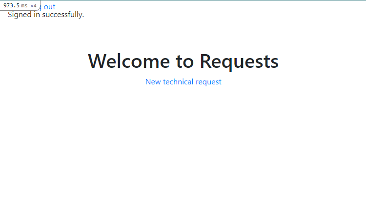
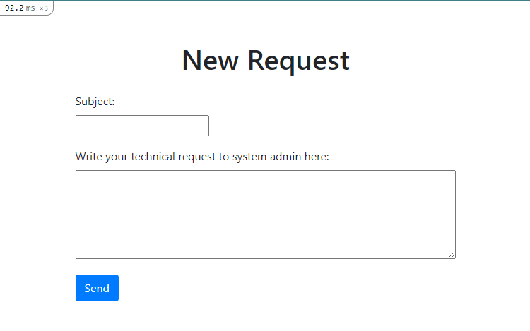
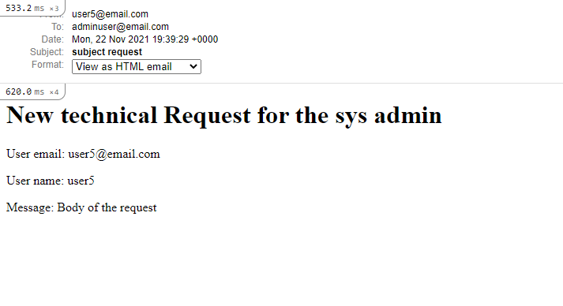
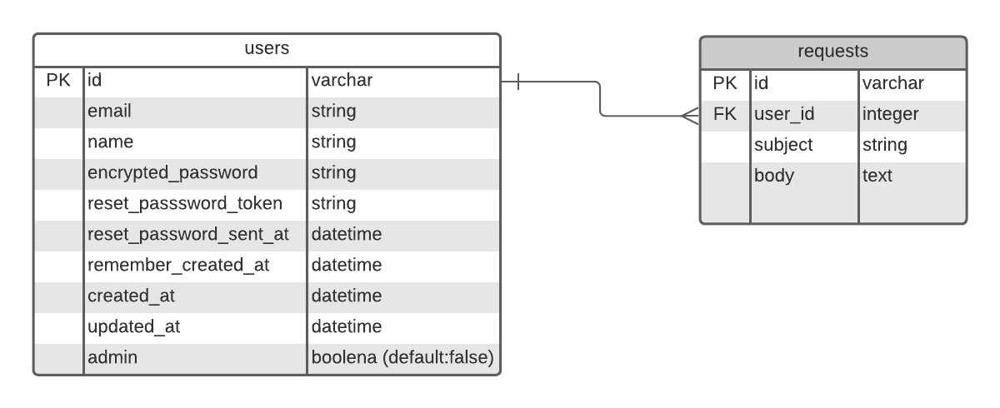
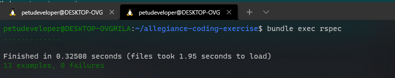

# Allegiance Coding Exercise

> This is a minicoding excercise that allows users to send an technical resquest email to the system admin.

User must be loged in to start using the App




Rails Mailer Test View



Models and Relationships



Tests Passing



## Built With

- Ruby on Rails
- MySQL
- RSpec
- Linters (Rubocop-Stylint)

## Live Demo

[Live Demo Link](https://livedemo.com)


## Getting Started

To get a local copy up and running follow these simple example steps.

### Prerequisites
- MySQL
- Ruby 3.0.0

### Setup
- run on your terminal:
```
git clone https://github.com/petudeveloper/allegiance-coding-exercise.git
cd allegiance-coding-exercis
```

### Install
- run on your terminal:
```
bundle install
yarn install
npm install
```
- Setup Database and Seed it with examples:
```
rails db:create
rails db:migrate
rails db:seed
```

### Usage
- Run a local server:
```
rails server
```
- Visit Webpage and navigate:
```
http://localhost:3000
```

### Run tests
```
bundle exec rspec
```

## Author

👤 **David Alvarez**

- GitHub: [@petudeveloper](https://github.com/petudeveloper)
- Twitter: [@petudeveloper](https://twitter.com/petudeveloper)
- LinkedIn: [David Alvarez Mazzo](https://www.linkedin.com/in/davidalvarezmazzo/)
## 🤝 Contributing

Contributions, issues, and feature requests are welcome!

Feel free to check the [issues page](../../issues/).

## Show your support

Give a ⭐️ if you like this project!

## Acknowledgments

- Hat tip to anyone whose code was used
- Inspiration
- etc

## 📝 License

This project is [MIT](./MIT.md) licensed.
